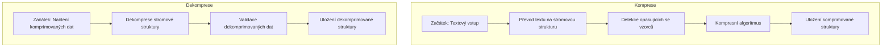

# Architektura systému

## :fontawesome-solid-arrow-up: Modulární struktura

Systém je navržen podle architektonického vzoru **Pipes and Filters**, což zajišťuje **modularitu**, **škálovatelnost** a **efektivitu**. Každý modul (filtr) vykonává specifickou operaci na datech a předává je dalšímu filtru v řetězci.

---

### :material-file-tree: Analýza textu
Modul zodpovědný za **syntaktickou analýzu** a **generování stromových struktur** z textových vstupů.

!!! info "Hlavní vlastnosti"
    - **Výstupy**: Generované stromové struktury.  
    - **Použité technologie**: `.NET`, knihovny pro syntaktickou analýzu jako **UDPipe** a **MorphoDiTa**.

---

### :material-chart-tree: Detekce vzorců
Identifikace **opakujících se vzorců** ve stromových strukturách umožňuje efektivní kompresi.

!!! tip "Výhody detekce vzorců"
    - **Výstupy**: Seznam vzorců pro kompresi.  
    - **Použité technologie**: Algoritmy pro detekci vzorců.

---

### :material-database: Kompresní algoritmy
Implementace **kompresních metod** pro optimalizaci stromových struktur.

=== "📌 Podporované algoritmy"
    - **Tree RePair algoritmus**
    - **Slovníkový algoritmus**

=== "📦 Výstupy"
    - Komprimované datové struktury.

!!! abstract "Jak funguje komprese?"
    Každý algoritmus optimalizuje strukturu dat **redukci redundance** a **efektivní reprezentací opakujících se vzorů**.

---

## :fontawesome-solid-diagram-project: Pipeline systému

Systém je rozdělen do dvou hlavních pipeline:

1. **Pipeline pro kompresi**: Zpracovává text, převádí jej na stromovou strukturu, komprimuje a ukládá výsledky.
2. **Pipeline pro dekompresi**: Načítá komprimovaná data, dekomprimuje je, validuje a ukládá.

### :material-flowchart: Diagram pipeline

:material-lightbulb-on: Výhody modulární struktury

- Snadné přidávání nových modulů bez zásahu do celého systému.
- Podpora různých velikostí dat bez ztráty výkonu.
- Možnost rozdělit výpočty mezi více jader procesoru pro zvýšení efektivity.

___

!!! success "Shrnutí" 
    Modulární přístup umožňuje lepší správu kódu, snadnější údržbu a podporuje experimentování s novými metodami.

    :fontawesome-solid-gears: Procesní pohled
    Všechny filtry běží v jednom hlavním vlákně. Paralelizace je zvažována pro kompresní algoritmy, aby bylo možné efektivně zpracovávat velké množství dat.

!!! example "Příklad pipeline" 
    Filtr pro syntaktickou analýzu: Zpracovává text a generuje stromovou strukturu. - Filtr pro detekci vzorců: Identifikuje opakující se vzory. - Filtr pro kompresi: Aplikuje kompresní algoritmus. - Filtr pro dekompresi: Obnovuje původní data.

## :fontawesome-solid-diagram-project: Diagram architektury

``` mermaid
classDiagram
    %% Main interfaces
    class IFilter {
        +Process(data: object): object
        +Chain(nextFilter: IFilter): IFilter
    }

    class ITreeNode {
        +Value: object
        +Children: IList<ITreeNode>
        +AddChild(child: ITreeNode): void
        +Accept(visitor: ITreeVisitor): void
    }

    class ITreeVisitor {
        +Visit(node: ITreeNode): void
    }

    class ICompressionStrategy {
        +Compress(tree: ITreeNode): CompressedTree
        +Decompress(compressedTree: CompressedTree): ITreeNode
    }

    %% Abstract factory for filters
    class FilterFactory {
        +CreateSyntacticAnalysisFilter(): IFilter
        +CreateCompressionFilter(strategy: ICompressionStrategy): IFilter
        +CreateDecompressionFilter(strategy: ICompressionStrategy): IFilter
    }

    %% Concrete filters
    class SyntacticAnalysisFilter {
        -nextFilter: IFilter
        +Process(text: object): object
        +Chain(nextFilter: IFilter): IFilter
    }

    class CompressionFilter {
        -nextFilter: IFilter
        -strategy: ICompressionStrategy
        +CompressionFilter(strategy: ICompressionStrategy)
        +Process(tree: object): object
        +Chain(nextFilter: IFilter): IFilter
    }

    class DecompressionFilter {
        -nextFilter: IFilter
        -strategy: ICompressionStrategy
        +DecompressionFilter(strategy: ICompressionStrategy)
        +Process(compressedTree: object): object
        +Chain(nextFilter: IFilter): IFilter
    }

    %% Tree structure (Composite pattern)
    class TreeNode {
        -value: object
        -children: List<ITreeNode>
        +Value: object
        +Children: IList<ITreeNode>
        +AddChild(child: ITreeNode): void
        +Accept(visitor: ITreeVisitor): void
    }

    class CompressedTree {
        +Patterns: Dictionary<int, ITreeNode>
        +Structure: byte[]
        +Metadata: Dictionary<string, string>
    }

    %% Strategy pattern for compression
    class CompressionStrategy {
        #FindPatterns(tree: ITreeNode): Dictionary<string, int>
        +Compress(tree: ITreeNode): CompressedTree
        +Decompress(compressedTree: CompressedTree): ITreeNode
    }

    class PatternBasedCompression {
        -minPatternSize: int
        -maxPatterns: int
        +PatternBasedCompression(minPatternSize: int, maxPatterns: int)
        +Compress(tree: ITreeNode): CompressedTree
        +Decompress(compressedTree: CompressedTree): ITreeNode
    }

    class StatisticalCompression {
        -threshold: double
        +StatisticalCompression(threshold: double)
        +Compress(tree: ITreeNode): CompressedTree
        +Decompress(compressedTree: CompressedTree): ITreeNode
    }

    %% Pipeline (Pipes and Filters implementation)
    class Pipeline {
        -firstFilter: IFilter
        -lastFilter: IFilter
        +AddFilter(filter: IFilter): Pipeline
        +Process(input: object): object
    }

    class TextProcessingFacade {
        -pipeline: Pipeline
        +TextProcessingFacade()
        +CompressText(text: string): CompressedTree
        +DecompressTree(compressedTree: CompressedTree): string
        +ValidateDecompression(originalText: string, decompressedText: string): bool
    }

    %% Observer Pattern for monitoring
    class IProcessObserver {
        +OnStart(process: string): void
        +OnProgress(process: string, percentComplete: double): void
        +OnComplete(process: string, result: object): void
        +OnError(process: string, error: Exception): void
    }

    class ProcessMonitor {
        +OnStart(process: string): void
        +OnProgress(process: string, percentComplete: double): void
        +OnComplete(process: string, result: object): void
        +OnError(process: string, error: Exception): void
    }

    %% Relationships
    Pipeline --> IFilter
    IFilter --> IFilter : chain
    FilterFactory ..> IFilter : creates
    CompressionFilter --> ICompressionStrategy : uses
    DecompressionFilter --> ICompressionStrategy : uses
    TextProcessingFacade --> Pipeline : uses
    TreeNode --> ITreeNode : contains
    CompressionStrategy --> CompressedTree : produces
    CompressionStrategy --> ITreeNode : consumes/produces
    TextProcessingFacade ..> IProcessObserver : notifies
```

