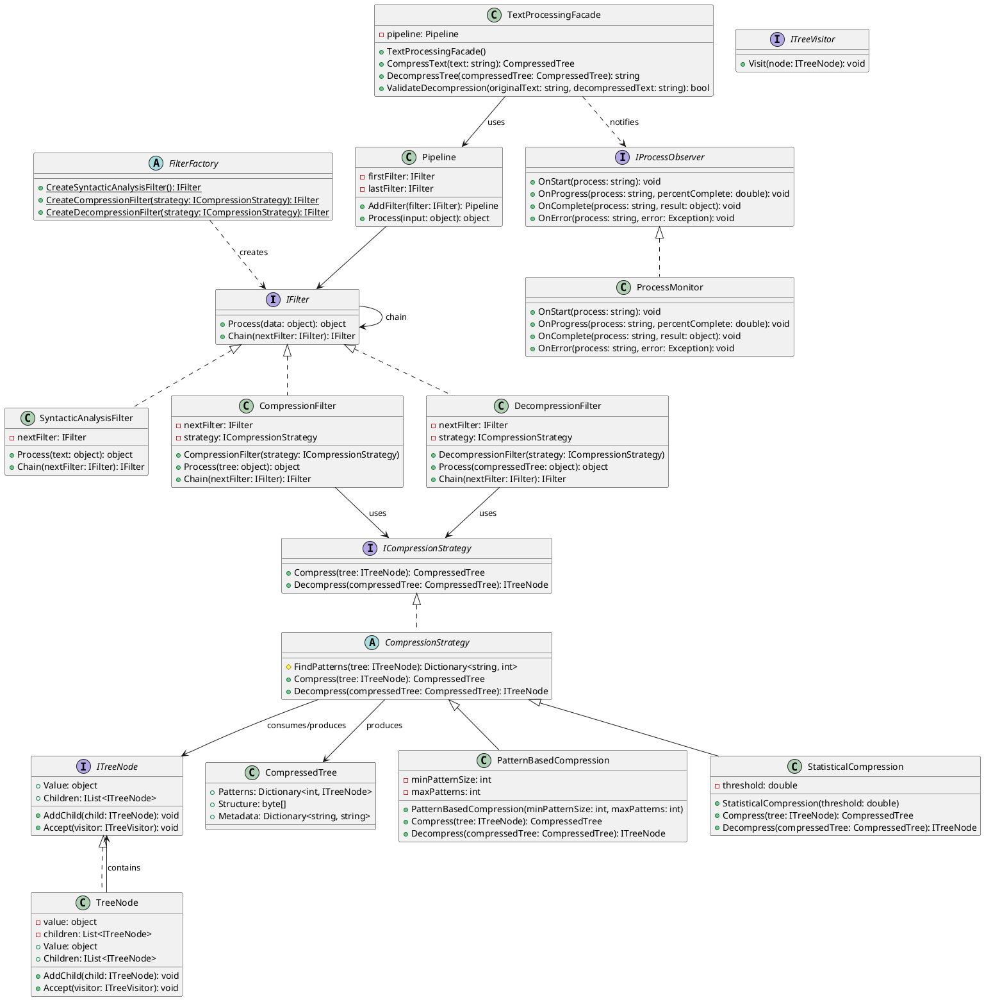

# Architektura systému

## 🏛️ Modulární struktura

Systém je rozdělen do několika modulů, zajišťujících flexibilitu a efektivitu.

### 📦 Analýza textu
Modul pro syntaktickou analýzu a generování stromových struktur z textů.

- **Výstupy**: Generované stromové struktury.
- **Použité technologie**: .NET

### 🧠 Detekce vzorců
Tento modul identifikuje opakující se vzory ve stromových strukturách, které lze komprimovat.

- **Výstupy**: Seznam vzorců pro kompresi.
- **Použité technologie**: Algoritmy pro detekci vzorců.

### ⚙️ Kompresní algoritmy
Implementace kompresních metod pro optimalizaci stromových struktur.

- **Typy algoritmů**: Huffmanovo kódování, LZW.
- **Výstupy**: Komprimované datové struktury.

> **Tip**: Každý modul je navržen pro snadnou rozšiřitelnost a testování nových metod.

## 💡 Výhody modulární struktury

- **Flexibilita**: Snadno přidáváte nové moduly.
- **Škálovatelnost**: Podporuje práci s různými velikostmi dat.
- **Paralelizace**: Každý modul lze paralelizovat pro zrychlení výpočtů.

